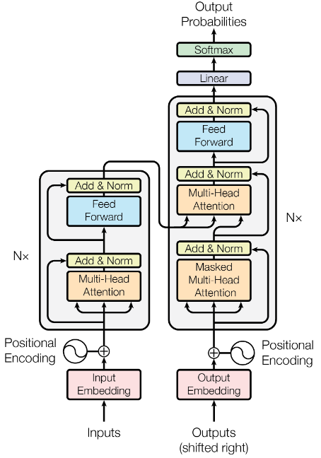

# Transformers in Tensorflow 2

A personal open source implementation of **Transformers** (original paper: [here](https://arxiv.org/pdf/1706.03762.pdf)) in **Tensorflow 2**  with some improvements found by researchers (sometimes updated).

Created in **07/2021** by **Valentin Goldité** ([github:valentingol](https://github.com/valentingol))



## Quick start

Install the dependencies in a new python virtual environment:

```.
pip install -r requirements.txt
```
